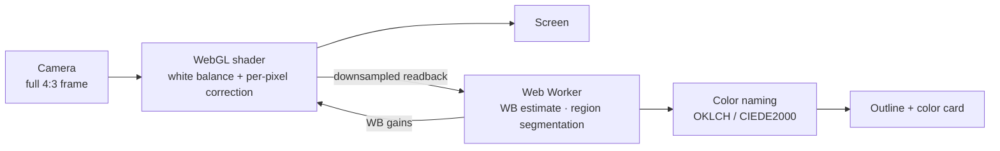

<div align="center">


# Color Vision Helper · 色觉助手

**A phone color assistant for people with color-vision deficiency: point at anything to hear its color, switch on correction to tell red from green.**

[**Open the app →**](https://ruilin.li/AnomalousTrichromatismHelper/) &nbsp;·&nbsp; [中文](README.md)

<a href="https://ruilin.li/AnomalousTrichromatismHelper/"></a>


<br><br>


<sub>Left: Identify, the reticle on the cup reads “Maroon” and outlines the whole region · Middle: Correct, split view of the original and the picture for a deutan viewer · Right: Tune, a two-step test that measures your color vision and checks the correction</sub>

</div>

---

## What it does

- **Identify**: a small crosshair sits in the middle of the screen. Whatever it points at gets a color name, and the whole region of that color is outlined. Shadows, highlights and fabric texture don't break an object apart, and the region doesn't leak through thin gaps into similar colors next to it.
- **Two color sets**: 12 basic colors (red, orange, yellow, green…), or 150+ detailed names such as “Brick red” and “Olive green”, plus a systematic description like “dark yellow-green”. Colors between two categories get a “may also be called…” hint.
- **Real-time correction**: every pixel of the camera feed is processed on the GPU, turning the red–green differences you can't see into lightness and blue–yellow differences you can. Choose protan, deutan or tritan and a severity of 0–100 %, with a split-screen comparison.
- **Tune**: a two-step test of about two minutes. It measures your type and severity, then blind-tests the correction with patterns below your own threshold and strengthens it if they are still not clear.
- **Color-plate tests**: in “Strong” mode at 170–200 %, the figure in a dot plate turns bright blue on a yellow background.
- **Built for real scenes**: automatic white balance (or one-tap white-card calibration), lens picker (main / ultra-wide / tele), full 4:3 framing, zoom, torch, freeze, pick from gallery, speech.
- **中文 / English** in one tap. Video never leaves the phone.

## Results

### Everyday scenes


Simulated with a CVD model for a viewer with 80 % deuteranomaly. Compensation alone (“Natural”) is limited by the screen gamut and turns the red into gray-brown. “Balanced” moves the part it cannot compensate into blue–yellow and lightness, so the red motorbike and the green objects separate again.

| Confused pairs that become distinguishable | Natural (compensation only) | Balanced | Strong |
| --- | :---: | :---: | :---: |
| Deutan 60 % | 70 % | 82 % | 93 % |
| Deutan 80 % | 53 % | 91 % | 96 % |
| Deuteranope (100 %) | 10 % | 79 % | 97 % |
| Protan 80 % | 63 % | 88 % | 94 % |
| Protanope (100 %) | 15 % | 91 % | 97 % |

<sub>Sample: 5159 color pairs (ΔE 12–60) taken from 5 natural photos and everyday colors, with type and severity set correctly. “Auto” picks Strong at ≥ 90 % severity and Balanced otherwise. With the wrong setting (everyone on the default “deutan 60 %”), Auto still recovers 67–90 %, while compensation alone drops to 21–39 %. Strong separates the most but also changes colors the most.</sub>

### Color plates


Six original Ishihara-style plates: figure and background differ only along the red–green confusion line, and dot lightness is random. Each plate was filmed through a simulated phone camera (warm light, blur, noise, shake, chroma subsampling), run through the full app pipeline, then viewed through the CVD model. Uncorrected, neither deutan 80 % nor a deuteranope can see any figure. With Strong 200 % all six are readable. Figure/ground separability is d′ 3.9–16.3, at or above normal vision on the original (2.8–7.0).

## Getting started

1. Open **https://ruilin.li/AnomalousTrichromatismHelper/** in your phone's browser and allow the camera.
2. To use it full-screen like an app: Android Chrome menu → “Add to Home screen / Install app”; iPhone Safari Share → “Add to Home Screen”.
3. The first time you open “Correct”, tap the yellow **Tune** button, take the test, then tap “Use for correction”.

| I want to… | Do this |
| --- | --- |
| know what color something is | In Identify, point the reticle at it; tap anywhere to move the reticle, double-tap to recenter |
| change how much gets outlined | Move the “Range” slider on the right down (similar colors merged) or up (a shaded or glossy object not fully covered); swiping up and down on the picture works too |
| tell red from green | Switch to Correct and use “Auto”; if it's not strong enough, raise the strength or pick “Strong” |
| read a color-plate test | “Strong” at 170–200 %; fill the frame with the plate, light it evenly, avoid glare |
| fix yellow or blue lighting | Toolbar “WB” → “White card”, point at white paper and tap once |
| stop the picture looking zoomed in | Toolbar “Lens” → “Whole frame”, or pick another rear camera |

## How it works



<details>
<summary><b>Color naming and region segmentation</b></summary>

- Color spaces: sRGB → linear RGB → OKLab / OKLCH (perceptually uniform and cheap). Detailed names are matched with CIEDE2000; a name gets “≈” when the difference exceeds 12.
- The 12 basic colors are split by hue, lightness and chroma in OKLCH, with thresholds relative to the sRGB gamut cusp of each hue (brown = dark orange/yellow, pink = light red/rose).
- Segmentation runs in a Web Worker so the UI never stalls:
  1. downsample to about 80k pixels and apply a 5×5 box filter;
  2. use shading-invariant chromaticity (a/L, b/L): a shadow scales linear RGB, which leaves the ratio unchanged;
  3. split the color difference into a hue direction (strict) and a saturation direction (loose), plus a log-lightness ratio;
  4. widen the tolerance by the robust spread of the texture around the reticle, then multiply by the Range factor k = 0.15 + 1.85·p²;
  5. hysteresis growth: close “core” pixels spread freely, edge pixels reach at most 4 pixels, so regions don't leak through thin contacts;
  6. opening, keep the connected component, closing and hole filling, then Marching Squares for a sub-pixel outline;
  7. region color: drop the darkest 15 % and brightest 10 %, take the median chroma and the 60th-percentile lightness.

</details>

<details>
<summary><b>White balance</b></summary>

A gray-world estimate on the brightest 15 % of pixels, then two passes over near-neutral pixels to estimate the illuminant. The object being measured is excluded. Correction strength follows the share of gray pixels, then is clamped and smoothed over time. White-card calibration computes per-channel gains from the reference white directly, and on Android it also locks the camera's own white balance.

</details>

<details>
<summary><b>Correction methods</b></summary>

CVD simulation uses the physiological model of Machado et al. (2009) in linear RGB, interpolated over 0–100 % severity.

| Method | For | How |
| --- | --- | --- |
| Auto (default) | most people | Balanced below 90 % severity, Strong at ≥ 90 %; tritan always uses Balanced |
| Balanced | color weakness | inverse compensation within the screen gamut (Ro & Yang 2004), then the red–green difference e that the model says you still miss is encoded into blue–yellow and lightness (b −= 1.5·e, L += 0.35·e) |
| Natural | mild color weakness | inverse compensation with hue-preserving gamut mapping only; colors stay closest to the original |
| Strong | color blindness, plate tests | the whole red–green axis is added onto blue–yellow and lightness in OKLab; above 100 % the lightness term grows as (strength − 1)², which beats the lightness camouflage of color plates |
| Simulate | people with normal vision | shows what a viewer with this deficiency sees, to understand or check the effect |

The GPU shader matches the CPU reference implementation pixel for pixel (max difference 0).

</details>

<details>
<summary><b>Tuning</b></summary>

- **Step 1: measure.** Dot-pattern Landolt C rings in the style of the Cambridge Colour Test, with random dot lightness so that lightness gives no cue. The three test directions are the colors protanopes, deuteranopes and tritanopes find hardest to see (the smallest singular vectors of the Machado matrices). A 2-down/1-up staircase finds each threshold, and type, severity and personal sensitivity are fitted jointly, so screen calibration doesn't matter.
- **Step 2: verify.** The model is only an approximation, so the correction is checked on your own eyes. Plates are shown at 60 % of your threshold, where they are invisible uncorrected: 4 corrected and 3 uncorrected, shuffled. Reading 3 of the 4 corrected plates passes; otherwise the correction escalates to “Balanced 130 %”, then “Strong 100 %”, then “Strong 200 %”.
- In simulation, observers with deutan 50–90 %, protan 70–100 % and tritan 80–100 % ended with a verified setting in 78–100 % of runs.

</details>

## Development

No build step, plain ES modules.

```bash
npm start            # http://localhost:8765 (localhost may use the camera)
npm test             # unit tests, Node 18+
npm run test:e2e     # end-to-end: synthetic camera video + Playwright Chromium
                     # needs numpy, Pillow, ffmpeg, playwright
```

Use a real photo as the fake camera:

```bash
python3 tests/make_photo_scene.py photo.png /tmp/real.y4m
python3 tests/e2e_real.py /tmp/real.y4m /tmp/shots
```

The 26 unit tests cover:

- CIEDE2000 reference data, color naming and the Machado matrices;
- separation gains from compensation and Balanced;
- segmentation under strong shading, texture and thin-gap leaks;
- auto white balance and lens-label parsing;
- tuner fitting and the two-step flow;
- Ishihara-style plates.

<details>
<summary><b>Project layout</b></summary>

```
docs/                       site root (served by GitHub Pages)
├── index.html              page and icon sprite
├── manifest.webmanifest    PWA manifest
├── sw.js                   offline cache
├── css/style.css
├── icons/
└── js/
    ├── main.js             UI and main loop
    ├── gl.js               WebGL renderer and correction shader
    ├── cvd.js              simulate / compensate / balanced / strong
    ├── machado.js          Machado 2009 matrices
    ├── color.js            color spaces and CIEDE2000
    ├── naming.js           basic / detailed color names
    ├── segment.js          region segmentation and outline
    ├── wb.js               auto white balance
    ├── analysis-worker.js  background analysis thread
    ├── camera.js           lens / zoom / torch / WB lock
    ├── selftest.js         color-vision tuning
    └── i18n.js             Chinese and English strings
tests/                      unit and end-to-end tests
assets/                     README images
```

</details>

<details>
<summary><b>Deploy to GitHub Pages</b></summary>

1. Push to GitHub.
2. In the repository, open **Settings → Pages**. Under Build and deployment choose **Deploy from a branch**, branch `main`, folder **`/docs`**.
3. About a minute later, open `https://<user>.github.io/AnomalousTrichromatismHelper/`. If your user site has a custom domain, project pages appear under it automatically; the project repo needs no Custom domain of its own.

Pages on a private repository needs GitHub Pro, Team or Enterprise; the Pages site itself is still public. Browsers only allow the camera on HTTPS pages.

</details>

## Limitations

- This is an aid, not a diagnosis. It does not replace a clinical color-vision exam (Ishihara, FM-100, anomaloscope). The numbers above come from simulated CVD viewers; real people differ, so trust your own Tune result.
- Phone cameras change colors with exposure and white balance. Auto white balance can be off when nothing white or gray is in view; use the white card then. Safari on iPhone doesn't let web pages lock the camera's white balance.
- Balanced and Strong change the lightness and yellow/blue tint of some colors. The aim is to make colors distinguishable, not to show them as they really are.
- Android usually labels lenses only by number, so they appear as “Rear camera 1 / 2 …”.

## References

**Methods used in the app**

- G. M. Machado, M. M. Oliveira, L. A. F. Fernandes. A physiologically-based model for simulation of color vision deficiency. *IEEE TVCG* 15(6), 2009.
- Y. M. Ro, S. Yang. Color adaptation for anomalous trichromats. *Int. J. Imaging Systems and Technology* 14, 16–20, 2004.
- B. C. Regan, J. P. Reffin, J. D. Mollon. Luminance noise and the rapid determination of discrimination ellipses in colour deficiency. *Vision Research* 34(10), 1994. (Cambridge Colour Test)
- B. Ottosson. A perceptual color space for image processing (OKLab), 2020.
- G. Sharma, W. Wu, E. N. Dalal. The CIEDE2000 color-difference formula: implementation notes, supplementary test data, and mathematical observations. *Color Research & Application* 30(1), 2005.
- He Z., Zhan P., Li J., Cai J., Zeng X., Zhang X. Partial rectification method of color blindness based on image segmentation. *Computer Systems & Applications* 26(3), 2017. (in Chinese)

**Background reading**

- H. Brettel, F. Viénot, J. D. Mollon. Computerized simulation of color appearance for dichromats. *JOSA A* 14(10), 2647–2655, 1997.
- K. Rasche, R. Geist, J. Westall. Re-coloring images for gamuts of lower dimension. *Computer Graphics Forum* 24(3), 2005.
- K. Rasche, R. Geist, J. Westall. Detail preserving reproduction of color images for monochromats and dichromats. *IEEE Computer Graphics and Applications* 25(3), 2005.
- A. A. Gooch, S. C. Olsen, J. Tumblin, B. Gooch. Color2Gray: salience-preserving color removal. *ACM Transactions on Graphics* 24(3), 2005.
- T. Wachtler, U. Dohrmann, R. Hertel. Modeling color percepts of dichromats. *Vision Research* 44, 2843–2855, 2004.
- C. E. Martin, J. G. Keller, S. K. Rogers, M. Kabrisky. Color blindness and a color human visual system model. *IEEE Trans. SMC — Part A* 30(4), 2000.
- S. Nakauchi, S. Usui. Multilayered neural network models for color blindness. *IJCNN*, 1991.
- J. Lee, W. P. dos Santos. An adaptive fuzzy-based system to simulate, quantify and compensate color blindness. arXiv:1711.10662, 2017.
- Five Chinese theses on color-blindness correction (Sun Y., Liu Y., Bao J., Wang E., Wu L.), listed in the [Chinese README](README.md#参考文献).

---

<div align="center"><sub>Made by <a href="https://ruilin.li">RoryLi98</a></sub></div>
