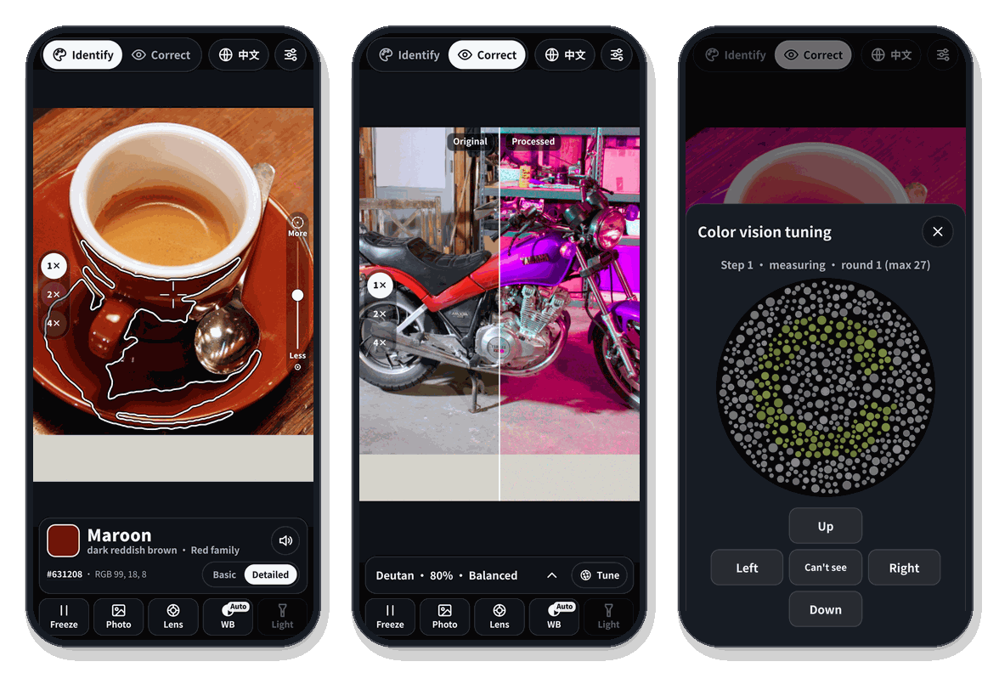
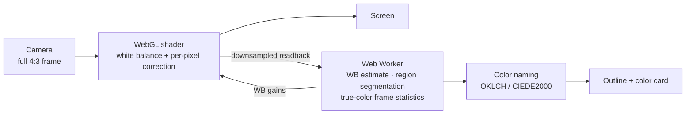

<div align="center">


# Color Vision Helper

**Point your phone at anything to hear its color. Switch on correction to tell red from green.**

A camera web app for people with color blindness or color weakness: no install, no account, and the video never leaves your phone.

[**Open the app →**](https://ruilin.li/AnomalousTrichromatismHelper/) &nbsp;·&nbsp; English &nbsp;·&nbsp; [简体中文](README.zh-CN.md)

<a href="https://ruilin.li/AnomalousTrichromatismHelper/"></a>


<br><br>



<sub><b>Identify</b>: the reticle on the cup reads “Maroon” and outlines the whole region · <b>Correct</b>: the original next to the picture adjusted for a deutan viewer · <b>Tune</b>: a two-minute test that measures your color vision and checks the correction</sub>

</div>

---

## Features

- **Identify colors.** Aim the reticle and get a color name, plus an outline of the whole region of that color.
  - Shadows, highlights and fabric texture don't break an object apart.
  - The outline doesn't leak into similar colors next to it.
- **Basic or exact names.** Choose 12 basic colors (red, orange, yellow…) or 150+ exact names such as “Maroon” and “Olive green”.
  - Each exact name comes with a description like “dark yellow-green”.
  - Colors near a boundary also get a “may also be called…” hint.
  - Switch with **Name: Basic | Exact** on the color card.
- **Two scenes: Real and Screen** (new in 1.5). Pick one in the top bar; each has Identify and Correct.
  - **Screen** reads the pixel colors, which is right for a screen, a screenshot or a picture: their pixels are the colors.
  - **Real** estimates the object's own color. A dim room turns the camera picture gray or brown, so a name read from the pixels would describe the picture, not the object. The estimate uses one of four sources, chosen under **Light**:
    - **Camera only:** the brightest white or gray surface in view is taken as white. A dashed box shows which surface; tap **Not white** if it is really gray.
    - **White paper:** a sheet of white paper, or an 18 % gray card, next to the object.
    - **Torch:** the picture with the torch on and off at a locked exposure (Chrome on Android, on cameras where manual exposure works; the app checks).
    - **Chart:** a ColorChecker, or a 14-patch card you print from the app. A chart in view is found automatically.
  - **A hint line above the color card** says which source is being used and what it is based on, with one optional action (such as **Not white**). Tap it for the full explanation, the numbers in use and everything that can be adjusted. Close it with × and it stays closed; the **ⓘ** chip on the color card (or ⓘ on the correction panel) opens the explanation again, and **Settings → Hints → Show again** brings the hints back. Steps that need you (picking a chart, tapping the paper, a measurement running) are always shown.
  - **Not sure? Two names.** When the color's name would change within the method's typical error, the card says “orange or brown” and why.
  - **Correct in the Real scene** restores the whole picture to the objects' own colors first, then corrects it, so dim scenes still have color differences to work with.
  - Freezing in the Real scene averages up to 8 frames for less noise. A photo from the gallery asks whether it shows real objects or a screen.
  - **Validation on your phone:** with a 24-patch chart in view, every method is scored on the 24 known colors; results stay on the phone and can be exported as JSON.
- **Real-time correction.** The GPU processes every pixel of the camera feed, turning the red–green differences you can't see into lightness and blue–yellow differences you can. It works for protan, deutan and tritan at 0–100 % severity, with a split-screen view.
- **Two-minute tuning.** It measures your type and severity, then checks the correction on patterns below your own threshold and strengthens it until you can read them.
- **Color-plate tests.** In **Strong** mode at 170–200 %, the hidden number in an Ishihara-style dot plate turns bright blue on yellow.
- **Made for real scenes.**
  - White balance: automatic, or one-tap white-card calibration.
  - Camera: a lens picker, full 4:3 framing, zoom and torch.
  - Also: freeze, gallery photos, spoken names, and five reticle styles that keep the centre clear.
- **Easy to read.** Text size Standard / Large / Extra large in Settings; buttons are at least 40 px tall; one shape system (rounded panels, pill-shaped choices, round icon buttons, rounded picture corners).
- **English / 中文** in Settings (and in the top bar on wide screens). Everything runs on the phone, and nothing is uploaded.

## Quick start

1. Open **[ruilin.li/AnomalousTrichromatismHelper](https://ruilin.li/AnomalousTrichromatismHelper/)** in your phone's browser and allow the camera.
2. Optional, to run it full-screen like an app:
   - Android Chrome: menu → **Add to Home screen / Install app**.
   - iPhone Safari: Share → **Add to Home Screen**.
3. The first time you switch to **Correct**, tap the yellow **Tune** button, take the test, then tap **Use for correction**.

| I want to… | Do this |
| --- | --- |
| know what color something is | In **Identify**, aim the reticle at it. Tap anywhere to move the reticle, double-tap to recenter. |
| outline more or less | Use the slider on the right: toward **Less** when similar colors merge, toward **More** when a shaded or glossy object isn't fully covered. Swiping up and down on the picture works too, and a short note says what the current setting does. |
| keep the reticle out of the way | Settings → **Reticle**: open cross, ring, brackets, dot or crosshair, in three sizes. |
| tell red from green | Switch to **Correct** and keep **Auto**. If the effect is too weak, raise the strength or pick **Strong**. |
| read a color-plate test | **Strong** at 170–200 %. Fill the frame with the plate, light it evenly and avoid glare. |
| fix yellow or blue lighting | Toolbar **WB** → **White card**, put white paper in the circle and tap **Calibrate**. |
| stop the picture looking zoomed in or square | Toolbar **Lens** → **Whole frame**, or pick another rear camera. The sheet shows the current resolution and aspect ratio. |
| use another lens | Pick it in **Lens**. If the phone doesn't let the browser open it, the app says why and goes back to the previous lens. On Android, Chrome gives the most complete lens, zoom and torch support. |
| be sure I have the latest version | Settings → **Check for updates**. |

## Results

### Everyday scenes


This is how a viewer with 80 % deuteranomaly sees the photo, simulated with a color-vision model. Compensation alone (**Natural**) is limited by what the screen can show and turns the red into gray-brown. **Balanced** moves the part it cannot compensate into blue–yellow and lightness, so the red motorbike and the green objects separate again.

| Confused color pairs that become distinguishable | Natural | Balanced | Strong |
| --- | :---: | :---: | :---: |
| Deutan 60 % | 70 % | 82 % | 93 % |
| Deutan 80 % | 53 % | 91 % | 96 % |
| Deuteranope (100 %) | 10 % | 79 % | 97 % |
| Protan 80 % | 63 % | 88 % | 94 % |
| Protanope (100 %) | 15 % | 91 % | 97 % |

<sub>5159 color pairs (ΔE 12–60) from five natural photos and everyday colors, with the type and severity set correctly.
<b>Auto</b> picks Strong at 90 % severity or more, and Balanced otherwise.
If everyone is left on the default “deutan 60 %”, Auto still recovers 67–90 %, while compensation alone drops to 21–39 %.
Strong separates the most but also changes colors the most.</sub>

### Color plates


Six original Ishihara-style plates. Figure and background differ only along the red–green confusion line, and dot lightness is random. Each plate was filmed through a simulated phone camera (warm light, blur, noise, shake, chroma subsampling), sent through the full app, then viewed through the color-vision model.

- **Uncorrected:** neither a deutan-80 % viewer nor a deuteranope can see any number.
- **With Strong 200 %:** all six are readable. Figure/ground separability (d′) is 3.9–16.3, at or above what normal vision gets from the original plates (2.8–7.0).

## How it works



<details>
<summary><b>Color naming and region outline</b></summary>

- **Color spaces:** sRGB → linear RGB → OKLab / OKLCH, which is perceptually uniform and cheap to compute.
  - Exact names are matched with CIEDE2000. A name gets “≈” when the difference exceeds 12.
  - The 12 basic colors are split by hue, lightness and chroma in OKLCH, with thresholds relative to the sRGB gamut cusp of each hue (brown = dark orange/yellow, pink = light red/rose).
- **Segmentation** runs in a Web Worker, so the interface never stalls:
  1. Downsample to about 80k pixels and apply a 5×5 box filter.
  2. Use shading-invariant chromaticity (a/L, b/L). A shadow scales linear RGB, which leaves this ratio unchanged.
  3. Split the color difference into a hue direction (strict) and a saturation direction (loose), plus a log-lightness ratio.
  4. Widen the tolerance by the robust spread of the texture around the reticle, then multiply by the slider factor k. The factor runs 0.1 → 0.224 over the lower half and 0.224 → 2.0 over the upper half, both geometric, and the default in the middle is k = 0.224.
  5. Hysteresis growth: close “core” pixels spread freely, while edge pixels reach at most 4 pixels, so regions don't leak through thin contacts.
  6. Opening, keep the connected component, closing and hole filling, then Marching Squares for a sub-pixel outline.
  7. Region color: drop the darkest 15 % and brightest 10 %, then take the median chroma and the 60th-percentile lightness.

</details>

<details>
<summary><b>White balance</b></summary>

- **Automatic:**
  - A gray-world estimate on the brightest 15 % of pixels, then two passes over near-neutral pixels to estimate the light color. The object being measured is left out.
  - Correction strength follows the share of gray pixels, and is clamped and smoothed over time.
- **White-card calibration:** per-channel gains are computed directly from the reference white. On Android the camera's own white balance is locked as well.

</details>

<details>
<summary><b>True color (Real scene)</b></summary>

A pixel is roughly exposure × light × the surface's own color, passed through the camera's processing. One picture can't separate the three, so each source supplies what is missing. In dim light the main error is lightness: the camera only partly brightens the picture, so a white wall can come out with the pixel values of a mid-gray one, and colors read as gray or brown.

The numbers below come from the app's own simulation of a phone camera (three simulation runs), not from real phones; the validation mode is there to measure them on yours.

- **Camera only:** the brightest near-neutral surface in view is taken as white paper (reflectance 0.85), or, if nothing neutral is in view, the brightest surface as 0.75. Glare of about 1 % of the frame mean is subtracted first. The object keeps its measured chromaticity and gets its lightness from that anchor.
  - The surface taken as white is outlined with a dashed box. If it is really light or mid gray, **Not white** scales the object's lightness accordingly.
  - **Shadows:** if the near-neutral surface closest to the object is less than half as bright as the frame's white, and the object is darker than that surface, the object is probably in a shadow with it, so it is measured against that surface. In simulation this takes an object in a shadow next to a white surface from 18 to 8 ΔE; scenes without a shadow pay 0.3–0.5 ΔE when a gray neighbour is mistaken for a shaded white. **Not a shadow** turns it off.
  - **Mixed light:** the light next to the object is estimated from the brightest surfaces around it. If it differs from the frame's white balance like two lights do (along the warm–cool line of lamps and daylight, more than 4500 K vs 6500 K), the object is corrected half way to the local light. A synthetic lamp-and-window scene goes from 10.9 to 5.7 ΔE; in one-light scenes it switches in 8 % of cases and changes the median by 0.15.
- **White paper:** found automatically next to the reticle, or tapped by hand when it is in the object's shadow. It gives per-channel gains and the lightness scale. Choose **18 % gray card** if that is what you use.
  - The automatic search looks for one connected, bright, near-neutral area. A wall or table that runs right through the view is skipped, also when the object splits it into two pieces, so a bright background is not mistaken for the sheet.
- **Torch:** the app sets a manual exposure, runs its own exposure loop, then reads frames with the torch on, off and on again. The difference is the object lit by the torch alone, which removes the room light. It is divided by the paper at the same distance or, without paper, by a one-time torch calibration on white paper at about 25 cm.
  - Without paper the torch gives the color (hue and saturation, which don't depend on distance) and the white anchor gives the lightness: 6.6 → 4.0 ΔE against camera only.
  - Chrome on Android offers manual exposure on any camera that can lock exposure, and on some of them the setting does nothing. So the first torch measurement halves the exposure time twice and checks that the picture gets half as bright each time. The same readings give a per-channel tone exponent.
  - The light color is held with a fixed white-balance preset (5000 K), or a white-balance lock where presets aren't available.
- **Chart:** found automatically, twice a second in the live picture and once on a frozen one. The search joins neighbouring pixels of the same color, keeps the square-ish regions, finds the two grid directions from the vectors between them, walks the grid and accepts a group of exactly 6 × 4 (ColorChecker) or 7 × 2 (printed card). A least-squares perspective map gives the corner patches. Tiled walls and keyboards are rejected because their colors don't fit the chart.
  - Without automatic detection, the four tapped corner patches give the same perspective map. All eight corner orders are tried and the best fit is kept, so the chart can be tapped in any order and held any way round.
  - The gray patches give a monotone curve per channel, then the colored patches a root-polynomial transform (r, g, b, √rg, √gb, √rb) that keeps gray gray. It follows the camera's own color processing better than a 3×3 matrix: in simulation, colors not on the chart come out at 1.7 instead of 2.4 ΔE (ColorChecker) and 3.3 instead of 3.8 (printed card).
  - Reference colors are the BabelColor averages for the ColorChecker and the design colors for the app's card. To match your printer, photograph the printed card next to a ColorChecker once.
- **Low-light desaturation:** a noisy camera image also loses saturation. Each chart fit records how much at the current noise level, and the camera-only and paper sources use those points to restore it. Between two recorded levels the value is interpolated only if they are at most 4× apart.
- **How sure:** the estimate is perturbed within the typical error of its source (camera only: lightness ±35 %, saturation ±28 %; white paper ±13 % / ±22 %; chart ±3 % / ±6 %). If the basic name changes in at least 2 of the 8 perturbed versions, both names are shown. In simulation, camera-only readings flagged this way are right 68 % of the time against 92 % for the others, and for half the wrong names the second name is the right one.
- **Freeze:** in the Real scene the frozen picture is the mean of up to 8 frames. A frame whose 8 × 8 block means differ from the first by more than 3 levels (the hand moved) is left out.
- **Correct mode and preview:** the same transform as camera only, white paper or the chart (gains, tone curve, root-polynomial, saturation) runs for every pixel in the shader before the color-vision correction. **Show the true-color picture in Identify too** uses it for the live view.
- **Default low-light saturation (off by default):** for lenses without a chart calibration, half the saturation a camera loses in dim light can be restored with a default curve. Phones differ a lot, so check with the validation whether it helps on yours.
- **Validation:** the 24 patches of a ColorChecker are scored with every method: picture color, camera only (with and without the default saturation), white paper (the sheet in view, or the chart's white patch) and the chart itself, leave-one-out. The table shows median and worst-10 % ΔE2000 and how many basic names are right. Each run keeps the raw patch colors, so it can be analysed again offline.
- **Lens calibration:** a ColorChecker (or a calibrated printed card) photographed with the live camera is also saved as that lens's color profile. White paper and camera only then pass the color through it, relative to the paper or the white anchor. It is used near the light level it was taken at, or at any level that has a saturation point. In simulation, with charts taken at three light levels, white paper improves from 4.3 to 3.5 ΔE and camera only from 7.2 to 6.3. **Clear calibration for this lens** removes it.

</details>

<details>
<summary><b>Correction methods</b></summary>

Color-vision deficiency is simulated with the physiological model of Machado et al. (2009) in linear RGB, interpolated over 0–100 % severity.

| Method | For | How |
| --- | --- | --- |
| Auto (default) | most people | Balanced below 90 % severity, Strong at 90 % or more; tritan always uses Balanced |
| Balanced | color weakness | Inverse compensation within the screen gamut (Ro & Yang 2004). The model then estimates the red–green difference e you still miss, and that difference is encoded into blue–yellow and lightness (b −= 1.5·e, L += 0.35·e) |
| Natural | mild color weakness | Inverse compensation with hue-preserving gamut mapping only; colors stay closest to the original |
| Strong | color blindness, plate tests | The whole red–green axis is added onto blue–yellow and lightness in OKLab. Above 100 %, the lightness term grows as (strength − 1)², which beats the lightness camouflage of color plates |
| Simulate | people with normal vision | Shows what a viewer with the chosen deficiency sees |

The GPU shader matches the CPU reference implementation pixel for pixel.

</details>

<details>
<summary><b>Tuning</b></summary>

- **Step 1: measure.**
  - The test uses dot-pattern Landolt C rings in the style of the Cambridge Colour Test, with random dot lightness so that lightness gives no cue.
  - The three test directions are the colors protanopes, deuteranopes and tritanopes find hardest to see (the smallest singular vectors of the Machado matrices).
  - A 2-down/1-up staircase finds each threshold. Type, severity and personal sensitivity are fitted together, so an uncalibrated screen doesn't matter.
- **Step 2: verify.** The model is only an approximation, so the correction is checked on your own eyes.
  - Plates are shown at 60 % of your threshold, where they are invisible without correction: 4 corrected and 3 uncorrected, shuffled.
  - Reading 3 of the 4 corrected plates passes. Otherwise the correction steps up to Balanced 130 %, then Strong 100 %, then Strong 200 %.
- **In simulation,** observers with deutan 50–90 %, protan 70–100 % and tritan 80–100 % ended with a verified setting in 78–100 % of runs.

</details>

## Development

No build step: plain ES modules served from `docs/`.

```bash
npm start              # http://localhost:8765 (localhost may use the camera)
npm test               # unit tests, Node 18+
npm run test:e2e       # end-to-end: synthetic camera video + Playwright Chromium
npm run test:e2e:lens  # lens picker: three fake cameras, failing and slow-to-release opens
npm run test:e2e:tc    # Real and Screen scenes: a dim, warm scene with paper and a chart (needs npm start)
                       # end-to-end tests need numpy, Pillow, ffmpeg and playwright
```

To use a real photo as the fake camera:

```bash
python3 tests/make_photo_scene.py photo.png /tmp/real.y4m
python3 tests/e2e_real.py /tmp/real.y4m /tmp/shots
```

The 49 unit tests cover:

- CIEDE2000 reference data, color naming and the Machado matrices;
- separation gains from compensation and Balanced;
- segmentation under strong shading, texture and thin-gap leaks, and the size-slider mapping;
- auto white balance, lens-label parsing and switching to a full 4:3 camera frame;
- tuner fitting and the two-step flow;
- Ishihara-style plates;
- true color: each source against a physical simulation of a phone camera (`tests/fixtures/truecolor_sim.json`), white-paper detection (also next to a lit wall), chart orientation, printed-card calibration, the lens calibration, and the manual-exposure check and torch sequence against a simulated camera;
- 1.5: shadows, torch without paper, two names when unsure, mixed light, the white anchor's position, the default saturation curve, automatic chart detection (rotated, small, printed card; not a tiled wall), validation scoring, and the shader transform against the per-color estimates.

The true-color end-to-end test (`tests/e2e_truecolor.py`, 28 checks) runs both scenes through Chromium's fake camera: the brown-looking orange object becomes orange with the chart found live, with white paper and with camera only; the hint line and its explanation sheet, closing and reopening hints, text size, “Not white”, averaged freeze, chart found on the frozen frame or tapped, lens calibration, validation with JSON export, Correct mode in the Real scene, the torch checks and the photo prompt.

To see which camera controls your phone gives a web page (torch, manual exposure, white-balance presets, focus), open [`lab/camera-probe.html`](https://ruilin.li/AnomalousTrichromatismHelper/lab/camera-probe.html) on the phone. The link is also under **Light → More options**.

<details>
<summary><b>Project layout</b></summary>

```
docs/                       site root (served by GitHub Pages)
├── index.html              page and icon sprite
├── manifest.webmanifest    PWA manifest
├── sw.js                   offline cache
├── css/style.css
├── icons/
└── js/
    ├── main.js             UI and main loop
    ├── gl.js               WebGL renderer and correction shader
    ├── cvd.js              simulate / compensate / balanced / strong
    ├── machado.js          Machado 2009 matrices
    ├── color.js            color spaces and CIEDE2000
    ├── naming.js           basic / exact color names
    ├── segment.js          region segmentation, outline, size slider
    ├── wb.js               auto white balance
    ├── truecolor.js        true color: the four sources, shadows, mixed light, uncertainty, chart fitting, lens calibration, validation, printable card
    ├── chartdetect.js      finds a ColorChecker or the printed card in the picture
    ├── measure.js          torch measurement and manual-exposure check
    ├── analysis-worker.js  background analysis thread
    ├── camera.js           lens / zoom / torch / WB lock
    ├── reticle.js          reticle styles
    ├── selftest.js         color-vision tuning
    └── i18n.js             English and Chinese strings
docs/lab/camera-probe.html  what this phone's camera lets a web page control
tests/                      unit and end-to-end tests
assets/                     README images
```

</details>

<details>
<summary><b>Deploy to GitHub Pages</b></summary>

1. Push to GitHub.
2. In the repository, open **Settings → Pages**. Under **Build and deployment**, choose **Deploy from a branch**, branch `main`, folder **`/docs`**.
3. About a minute later, open `https://<user>.github.io/AnomalousTrichromatismHelper/`. If your user site has a custom domain, project pages appear under that domain automatically, so the project repo needs no custom domain of its own.

Pages on a private repository needs GitHub Pro, Team or Enterprise; the Pages site itself is still public. Browsers only allow the camera on HTTPS pages.

</details>

## Limitations

- **An aid, not a diagnosis.** It does not replace a clinical color-vision exam (Ishihara, FM-100, anomaloscope). The numbers above come from simulated viewers; real people differ, so trust your own Tune result.
- **Cameras shift colors.** Exposure and white balance change what the camera sees.
  - Auto white balance can be off when nothing white or gray is in view; use the white card then.
  - Safari on iPhone doesn't let web pages lock the camera's white balance.
- **True color is an estimate.**
  - Camera only assumes the brightest neutral surface in view is white. If it is gray, colors come out too light; the dashed box shows which surface it is, and **Not white** corrects it.
  - A gray surface in good light and a white surface in a shadow look the same in one picture, so the shadow rule is sometimes wrong. Mixed light is only corrected half way, because a beige wall next to the object looks like warm light.
  - The typical errors used for “orange or brown” come from the simulation; your phone may be better or worse. Use the validation to find out.
  - The chart has to be in the light of the object, reasonably square to the camera and at least about a sixth of the picture wide to be found automatically.
  - White paper corrects the light color and lightness, but not all of the saturation a camera loses in very dim light.
  - Without paper, torch lightness assumes the object is about as far away as the paper was at calibration (about 25 cm).
  - The torch source needs Chrome on Android and a camera where manual exposure works. Safari on iPhone has no exposure control.
  - Two surfaces can match under one light and differ under another (metamerism), so even a chart leaves an error of about 1–2 ΔE.
- **Correction changes colors.** Balanced and Strong change the lightness and yellow/blue tint of some colors. The aim is to make colors distinguishable, not to show them as they really are.
- **Browsers limit lens access.**
  - Many Android phones expose only some lenses to browsers and label them only by number.
  - Some browsers, such as Firefox, don't support hardware zoom or the torch yet.

## References

**Methods used in the app**

- G. M. Machado, M. M. Oliveira, L. A. F. Fernandes. A physiologically-based model for simulation of color vision deficiency. *IEEE TVCG* 15(6), 2009.
- Y. M. Ro, S. Yang. Color adaptation for anomalous trichromats. *Int. J. Imaging Systems and Technology* 14, 16–20, 2004.
- B. C. Regan, J. P. Reffin, J. D. Mollon. Luminance noise and the rapid determination of discrimination ellipses in colour deficiency. *Vision Research* 34(10), 1994. (Cambridge Colour Test)
- B. Ottosson. A perceptual color space for image processing (OKLab), 2020.
- G. Sharma, W. Wu, E. N. Dalal. The CIEDE2000 color-difference formula: implementation notes, supplementary test data, and mathematical observations. *Color Research & Application* 30(1), 2005.
- He Z., Zhan P., Li J., Cai J., Zeng X., Zhang X. Partial rectification method of color blindness based on image segmentation. *Computer Systems & Applications* 26(3), 2017. (in Chinese)
- E. H. Land, J. J. McCann. Lightness and retinex theory. *JOSA* 61(1), 1–11, 1971. (white anchor)
- J. M. DiCarlo, F. Xiao, B. A. Wandell. Illuminating illumination. *IS&T/SID Color Imaging Conference*, 2001. (torch difference)
- G. Petschnigg, M. Agrawala, H. Hoppe, R. Szeliski, M. Cohen, K. Toyama. Digital photography with flash and no-flash image pairs. *ACM TOG* 23(3), 2004.
- C. S. McCamy, H. Marcus, J. G. Davidson. A color-rendition chart. *Journal of Applied Photographic Engineering* 2(3), 1976. (ColorChecker)
- D. Pascale. RGB coordinates of the Macbeth ColorChecker. The BabelColor Company, 2006.
- G. D. Finlayson, M. Mackiewicz, A. Hurlbert. Color correction using root-polynomial regression. *IEEE TIP* 24(5), 2015. (chart fit)
- W3C. MediaStream Image Capture (torch, exposure and white-balance constraints).

**Background reading**

- H. Brettel, F. Viénot, J. D. Mollon. Computerized simulation of color appearance for dichromats. *JOSA A* 14(10), 2647–2655, 1997.
- K. Rasche, R. Geist, J. Westall. Re-coloring images for gamuts of lower dimension. *Computer Graphics Forum* 24(3), 2005.
- K. Rasche, R. Geist, J. Westall. Detail preserving reproduction of color images for monochromats and dichromats. *IEEE Computer Graphics and Applications* 25(3), 2005.
- A. A. Gooch, S. C. Olsen, J. Tumblin, B. Gooch. Color2Gray: salience-preserving color removal. *ACM Transactions on Graphics* 24(3), 2005.
- T. Wachtler, U. Dohrmann, R. Hertel. Modeling color percepts of dichromats. *Vision Research* 44, 2843–2855, 2004.
- C. E. Martin, J. G. Keller, S. K. Rogers, M. Kabrisky. Color blindness and a color human visual system model. *IEEE Trans. SMC — Part A* 30(4), 2000.
- S. Nakauchi, S. Usui. Multilayered neural network models for color blindness. *IJCNN*, 1991.
- J. Lee, W. P. dos Santos. An adaptive fuzzy-based system to simulate, quantify and compensate color blindness. arXiv:1711.10662, 2017.
- Five Chinese theses on color-blindness correction (Sun Y., Liu Y., Bao J., Wang E., Wu L.), listed in the [Chinese README](README.zh-CN.md#参考文献).

---

<div align="center"><sub>Made by <a href="https://ruilin.li">RoryLi98</a></sub></div>
