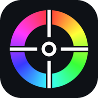
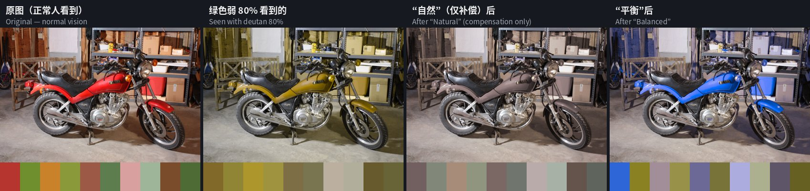
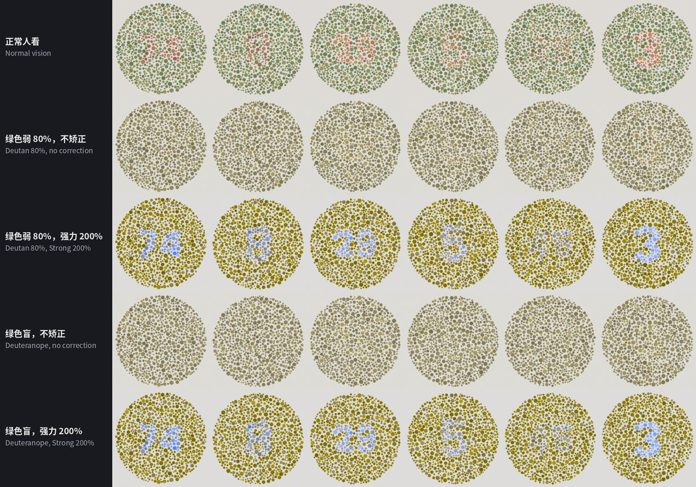
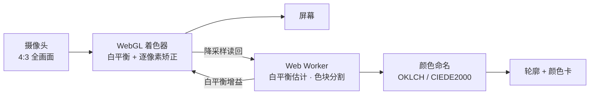

<div align="center">



# 色觉助手 · Color Vision Helper

**给色弱、色盲用户的手机颜色助手：对准就读出颜色，打开矫正就能分清红绿。**

[**在线打开 →**](https://ruilin.li/AnomalousTrichromatismHelper/) &nbsp;·&nbsp; [English](README.en.md)

<a href="https://ruilin.li/AnomalousTrichromatismHelper/"></a>


<br><br>


<sub>左：识色，准星对准杯子，读出“枣红”并勾出整个色块 · 中：矫正，分屏对比原图和给绿色弱看的画面 · 右：调校，两步测出你的色觉并检验矫正效果</sub>

</div>

---

## 它能做什么

- **识色**：屏幕中央有一个小十字准星，对准什么就读出什么颜色，同时勾出同一种颜色的整块区域。阴影、反光、布料纹理不会把一个物体切碎，也不会顺着细缝漏到旁边相近的颜色里。
- **两套颜色名**：基础 12 色（红、橙、黄、绿……），或 150 多个精细名称（如“砖红”“橄榄绿”），附带“深黄绿色”这类系统描述；颜色在两类之间时会提示“也可能被叫作……”。
- **实时矫正**：在 GPU 上逐像素处理摄像头画面，把你分不清的红绿差异转成你看得见的明暗和蓝黄差异。可选红色弱、绿色弱、蓝色弱三种类型和 0–100% 程度，支持分屏对比。
- **调校**：约 2 分钟的两步小测试。先测出类型和程度，再用低于你分辨极限的图案盲测矫正效果，不够清楚就自动加强。
- **看色盲检查图**：用“强力”模式把强度推到 170–200%，点阵图里的数字会变成黄色背景上的亮蓝色。
- **为真实场景设计**：自动白平衡（也可一键用白纸校准）、镜头选择（主摄 / 超广角 / 长焦）、完整 4:3 取景、变焦、补光灯、冻结画面、从相册选图、语音朗读。
- **中文 / English** 一键切换；视频只在手机本地处理，不上传。

## 效果

### 日常场景



用色弱模型模拟“绿色弱 80% 的人看到的样子”。只做补偿（“自然”）受屏幕色域限制，红色被压成灰褐色；“平衡”把补不回来的部分转成蓝黄和明暗差异，红色的摩托车和绿色的东西重新分得开。

| 原本分不清、处理后分得清的颜色对 | 自然（仅补偿） | 平衡 | 强力 |
| --- | :---: | :---: | :---: |
| 绿色弱 60% | 70% | 82% | 93% |
| 绿色弱 80% | 53% | 91% | 96% |
| 绿色盲 100% | 10% | 79% | 97% |
| 红色弱 80% | 63% | 88% | 94% |
| 红色盲 100% | 15% | 91% | 97% |

<sub>样本：5 张自然照片和常见颜色中取出的 5159 对颜色（色差 ΔE 12–60），类型和程度设置正确。“自动”在程度 ≥ 90% 时选强力，其余选平衡。设置不准时（全部按默认“绿色弱 60%”），“自动”仍能恢复 67–90%，纯补偿只剩 21–39%。强力的区分度最高，但颜色改变也最大。</sub>

### 色盲检查图



6 张自制的 Ishihara 式点阵图（数字和背景只在红绿混淆方向上不同，圆点亮度随机），先模拟手机拍摄（暖光、模糊、噪声、手抖、色度压缩），再走一遍 App 的完整处理流程，最后用色弱模型模拟观看。不矫正时绿色弱 80% 和绿色盲都看不出数字；强力 200% 后六张都能看清，可分度（d′ 3.9–16.3）达到或超过正常人看原图的水平（2.8–7.0）。

## 开始使用

1. 用手机浏览器打开 **https://ruilin.li/AnomalousTrichromatismHelper/**，允许使用摄像头。
2. 想像 App 一样全屏使用：Android Chrome 菜单 →“添加到主屏幕 / 安装应用”；iPhone Safari 分享按钮 →“添加到主屏幕”。
3. 第一次进入“矫正”时，先点黄色的 **调校** 按钮做一次测试，再点“应用到矫正”。

| 我想…… | 这样做 |
| --- | --- |
| 知道某样东西是什么颜色 | “识色”模式下把准星对准它；点画面任意位置移动准星，双击回中 |
| 色块圈得太大 / 太小 | 右侧“范围”滑条往下调（相近颜色被圈在一起时）或往上推（阴影、反光多的物体没圈全时），也可在画面上上下滑动 |
| 看清红绿 | 切到“矫正”；方法用“自动”，不够明显就调高强度或换“强力” |
| 看色盲检查图 | “强力”，强度 170–200%；让图占满画面，光线均匀，避开反光 |
| 灯光太黄 / 太蓝 | 工具栏“白平衡”→“白纸校准”，准星对准白纸点一下 |
| 画面像被放大了 | 工具栏“镜头”→ 选“完整画面”，或换一个后置镜头 |

## 工作原理



<details>
<summary><b>识色与色块分割</b></summary>

- 颜色空间：sRGB → 线性 RGB → OKLab / OKLCH（感知均匀、计算便宜）。精细名称用 CIEDE2000 找最近的命名颜色，色差大于 12 时名字前加“≈”。
- 基础 12 色在 OKLCH 上按色相、明度、彩度划分，阈值相对每个色相的 sRGB 色域顶点计算（棕色 = 暗的橙/黄，粉色 = 亮的红/玫红）。
- 色块分割在 Web Worker 里运行，不卡界面：
  1. 降采样到约 8 万像素，5×5 均值滤波；
  2. 用抗阴影色度 (a/L, b/L)：阴影相当于把线性 RGB 乘一个系数，这个比值不变；
  3. 色差分解为色相方向（严）和饱和度方向（松），再加对数亮度比；
  4. 按准星周围纹理的鲁棒离散度自动放宽容差，再乘上“范围”系数 k = 0.15 + 1.85·p²；
  5. 滞后生长：很像的核心像素自由扩散，边缘像素最多延伸 4 个像素，避免通过细缝漏进邻居；
  6. 开运算、保留连通域、闭运算和小孔填充，Marching Squares 提取亚像素轮廓；
  7. 色块代表色：去掉最暗 15% 和最亮 10%，取色度中位数和 60 分位亮度。

</details>

<details>
<summary><b>白平衡</b></summary>

先用最亮 15% 的像素做灰度世界估计，再两轮挑出接近中性灰的像素估计光源；正在测的物体不参与估计。按灰像素比例决定校正强度，限幅并做时间平滑。白纸校准直接用参考白计算各通道增益，安卓上还会锁定相机自身的白平衡。

</details>

<details>
<summary><b>矫正方法</b></summary>

色弱模拟采用 Machado 等（2009）的生理模型，作用于线性 RGB，程度 0–100% 插值。

| 方法 | 适合 | 做法 |
| --- | --- | --- |
| 自动（默认） | 大多数人 | 程度 < 90% 用平衡，≥ 90% 用强力；蓝色弱始终用平衡 |
| 平衡 | 色弱 | 先在屏幕色域内做逆向补偿（Ro & Yang 2004），再用模型算出补偿后仍看不到的红绿差异 e，编码到蓝黄轴和明度上（b −= 1.5·e，L += 0.35·e） |
| 自然 | 轻度色弱 | 只做逆向补偿和保持色相的色域映射，颜色最接近原样 |
| 强力 | 色盲、看检查图 | 在 OKLab 中把整条红绿轴叠加到蓝黄轴和明度上；强度超过 100% 时明度项按 (强度 − 1)² 加大，压过检查图故意加的亮度噪声 |
| 模拟色弱 | 正常色觉的人 | 显示色弱者眼中的画面，用来理解或验证效果 |

GPU 着色器与 CPU 参考实现逐像素对比，误差为 0。

</details>

<details>
<summary><b>调校</b></summary>

- **第一步：测量。** 类似 Cambridge Colour Test 的点阵 Landolt C，亮度随机抖动，排除亮度线索。三个刺激方向分别是红 / 绿 / 蓝色盲最难看出的颜色方向（Machado 矩阵的最小奇异向量），用 2-down/1-up 阶梯法求阈值，再联合拟合类型、程度和个人灵敏度，所以不依赖屏幕校色。
- **第二步：检验。** 模型只是近似，所以直接在你的眼睛上验证：在你阈值的 60% 处出图（未矫正时看不清），4 张矫正、3 张不矫正随机混排；矫正后 4 张看清 3 张算通过，否则依次加强到“平衡 130%”“强力 100%”“强力 200%”。
- 模拟测试中，绿色弱 50–90%、红色弱 70–100%、蓝色弱 80–100% 的观察者在 78–100% 的测试里都得到了通过验证的设置。

</details>

## 本地开发

不需要构建，纯 ES Modules。

```bash
npm start            # http://localhost:8765（localhost 允许打开摄像头）
npm test             # 单元测试，Node 18+
npm run test:e2e     # 端到端测试：合成摄像头视频 + Playwright Chromium
                     # 需要 numpy、Pillow、ffmpeg、playwright
```

用一张真实照片当虚拟摄像头：

```bash
python3 tests/make_photo_scene.py 照片.png /tmp/real.y4m
python3 tests/e2e_real.py /tmp/real.y4m /tmp/shots
```

26 项单元测试覆盖：CIEDE2000 参考数据、颜色命名、Machado 矩阵、补偿与平衡的区分度、强阴影 / 纹理 / 细缝漏边、自动白平衡、镜头名称识别、调校拟合与两步流程、Ishihara 式点阵图。

<details>
<summary><b>项目结构</b></summary>

```
docs/                       网站根目录（GitHub Pages 从这里发布）
├── index.html              页面与图标
├── manifest.webmanifest    PWA 清单
├── sw.js                   离线缓存
├── css/style.css
├── icons/
└── js/
    ├── main.js             界面与主循环
    ├── gl.js               WebGL 渲染与矫正着色器
    ├── cvd.js              模拟 / 补偿 / 平衡 / 强力
    ├── machado.js          Machado 2009 矩阵
    ├── color.js            颜色空间与 CIEDE2000
    ├── naming.js           基础 / 精细颜色命名
    ├── segment.js          色块分割与轮廓
    ├── wb.js               自动白平衡
    ├── analysis-worker.js  后台分析线程
    ├── camera.js           镜头 / 变焦 / 补光 / 白平衡锁定
    ├── selftest.js         色觉调校
    └── i18n.js             中英文文案
tests/                      单元测试与端到端测试
assets/                     README 用图
```

</details>

<details>
<summary><b>部署到 GitHub Pages</b></summary>

1. 推送到 GitHub。
2. 仓库 **Settings → Pages** → Build and deployment 选 **Deploy from a branch**，Branch 选 `main`，文件夹选 **`/docs`**。
3. 约 1 分钟后访问 `https://<用户名>.github.io/AnomalousTrichromatismHelper/`。用户主页仓库绑定了自定义域名时，项目页会自动挂在该域名下，项目仓库里不用再填 Custom domain。

私有仓库使用 Pages 需要 GitHub Pro / Team / Enterprise；Pages 网站本身仍是公开的。摄像头只能在 HTTPS 页面里打开。

</details>

## 局限

- 本应用只是辅助工具，不能替代医院的色觉检查（如 Ishihara、FM-100、色觉镜）。上面的效果数据来自色弱模型模拟，真人效果因人而异，请以“调校”的结果为准。
- 手机摄像头的曝光和白平衡会改变颜色。画面里没有白色或灰色物体时自动白平衡可能不准，这时用白纸校准；iPhone 的 Safari 不允许网页锁定相机白平衡。
- “平衡”和“强力”会改变部分颜色的明暗和偏黄 / 偏蓝程度，目的是让你分得开，不是还原颜色本来的样子。
- 安卓的镜头名称通常只是编号，App 只能显示为“后置摄像头 1 / 2 ……”。

## 参考文献

**App 直接用到的方法**

- G. M. Machado, M. M. Oliveira, L. A. F. Fernandes. A physiologically-based model for simulation of color vision deficiency. *IEEE TVCG* 15(6), 2009.
- Y. M. Ro, S. Yang. Color adaptation for anomalous trichromats. *Int. J. Imaging Systems and Technology* 14, 16–20, 2004.
- B. C. Regan, J. P. Reffin, J. D. Mollon. Luminance noise and the rapid determination of discrimination ellipses in colour deficiency. *Vision Research* 34(10), 1994.（Cambridge Colour Test）
- B. Ottosson. A perceptual color space for image processing (OKLab), 2020.
- G. Sharma, W. Wu, E. N. Dalal. The CIEDE2000 color-difference formula: implementation notes, supplementary test data, and mathematical observations. *Color Research & Application* 30(1), 2005.
- 何志良, 詹佩真, 李嘉樱, 蔡家荣, 曾晓铭, 张昕. 基于图像分割的局部色盲矫正方法. *计算机系统应用* 26(3), 2017.

**背景阅读**

- H. Brettel, F. Viénot, J. D. Mollon. Computerized simulation of color appearance for dichromats. *JOSA A* 14(10), 2647–2655, 1997.
- K. Rasche, R. Geist, J. Westall. Re-coloring images for gamuts of lower dimension. *Computer Graphics Forum* 24(3), 2005.
- K. Rasche, R. Geist, J. Westall. Detail preserving reproduction of color images for monochromats and dichromats. *IEEE Computer Graphics and Applications* 25(3), 2005.
- A. A. Gooch, S. C. Olsen, J. Tumblin, B. Gooch. Color2Gray: salience-preserving color removal. *ACM Transactions on Graphics* 24(3), 2005.
- T. Wachtler, U. Dohrmann, R. Hertel. Modeling color percepts of dichromats. *Vision Research* 44, 2843–2855, 2004.
- C. E. Martin, J. G. Keller, S. K. Rogers, M. Kabrisky. Color blindness and a color human visual system model. *IEEE Trans. SMC — Part A* 30(4), 2000.
- S. Nakauchi, S. Usui. Multilayered neural network models for color blindness. *IJCNN*, 1991.
- J. Lee, W. P. dos Santos. An adaptive fuzzy-based system to simulate, quantify and compensate color blindness. arXiv:1711.10662, 2017.
- 孙养龙《基于 Android 的色盲矫正系统设计与实现》；刘雨君《基于图像处理的色盲辅助矫正方法研究》；鲍吉斌《基于图像颜色变换的色盲矫正方法研究》；王恩《色盲图像处理系统设计和算法研究》；吴丽思《色盲图像矫正算法研究及测试系统设计》（学位论文）。

---

<div align="center"><sub>由 <a href="https://ruilin.li">RoryLi98</a> 制作</sub></div>
