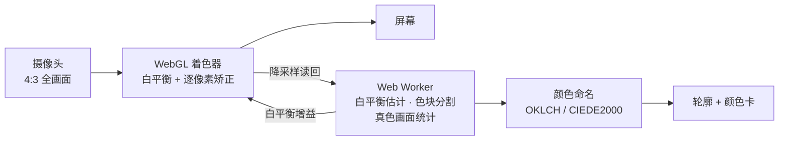

<div align="center">


# 色觉助手 · Color Vision Helper

**给色弱、色盲用户的手机颜色助手：对准就读出颜色，打开矫正就能分清红绿。**

[**在线打开 →**](https://ruilin.li/AnomalousTrichromatismHelper/) &nbsp;·&nbsp; [English](README.md) &nbsp;·&nbsp; 简体中文

<a href="https://ruilin.li/AnomalousTrichromatismHelper/"></a>


<br><br>


<sub>左：识色，准星对准杯子，读出“枣红”并勾出整个色块 · 中：矫正，分屏对比原图和给绿色弱看的画面 · 右：调校，两步测出你的色觉并检验矫正效果</sub>

</div>

---

## 它能做什么

- **识色**：屏幕中央有一个准星（5 种样式、3 种大小可选，默认中心留空不挡视线），对准什么就读出什么颜色，同时勾出同一种颜色的整块区域。阴影、反光、布料纹理不会把一个物体切碎，也不会顺着细缝漏到旁边相近的颜色里。
- **两套颜色名**：大类 12 色（红、橙、黄、绿……），或 150 多个精确名称（如“砖红”“橄榄绿”），附带“深黄绿色”这类系统描述；颜色在两类之间时会提示“也可能被叫作……”。颜色卡右下角的“色名 大类 | 精确”随时切换。
- **两种场景：真色和屏幕**（1.5 新增）：在顶栏选择，两种场景都有识色和矫正。
  - **屏幕**：直接读像素颜色。拍屏幕、看截图和图片时，像素就是它的颜色。
  - **真色**：估计物体本身的颜色。房间一暗，摄像头画面就发灰、发棕，按像素读出来的是“画面的颜色”，不是物体本身的颜色。在 **光线** 里选择来源（默认普通模式）：
    - **普通模式**：把画面里最亮的白色或灰色表面当作白色，画面上用虚线框标出；如果它其实是灰的，点“不是白色”；
    - **白纸**：在物体旁边放一张白纸，或一张 18% 灰卡；
    - **手电**：锁定曝光，比较手电开和关时的画面（需要安卓 Chrome，而且这颗镜头的手动曝光真的生效，App 会自己检查）；
    - **色卡**：ColorChecker，或从 App 下载打印的 14 色卡。画面里的色卡会自动找到。
  - **颜色卡写得短**：标签写着来源，后面三个点表示有多可信（实心越多越可信）；名字下面最多两条简短说明。窄屏手机或大字号下也不会被截断。
  - **颜色卡上方的提示行**写着现在用什么测、依据是什么，并附带一个可选操作（比如“不是白色”）。点它能看完整原理、正在用的数据和所有可调整的选项。点 × 关闭后不再显示；想再看，点颜色卡上的 **ⓘ** 标签（矫正模式下点面板上的 ⓘ），或在 **设置 → 提示 → 重新显示** 里恢复。需要你操作的步骤（框选色卡、点选白纸、正在测量）始终显示。
  - **拿不准时给两个名字**：如果在这种方法的典型误差范围里色名会变，颜色卡上会写“橙色或棕色”，并说明原因。
  - **真色场景下的矫正**会先把整幅画面还原成物体本身的颜色，再做色弱矫正，暗处也有颜色差别可以放大。
  - 真色场景下冻结画面会取最多 8 帧平均，噪声更低。从相册导入图片时会问它拍的是现实物体还是屏幕。
  - **在你的手机上验收**：画面里有 24 色卡时，用 24 个已知颜色给每种方法打分；结果只存在手机上，可以导出 JSON。
- **实时矫正**：在 GPU 上逐像素处理摄像头画面，把你分不清的红绿差异转成你看得见的明暗和蓝黄差异。可选红色弱、绿色弱、蓝色弱三种类型和 0–100% 程度，支持分屏对比。
- **调校**：约 2 分钟的两步小测试。先测出类型和程度，再用低于你分辨极限的图案盲测矫正效果，不够清楚就自动加强。
- **看色盲检查图**：用“强力”模式把强度推到 170–200%，点阵图里的数字会变成黄色背景上的亮蓝色。
- **为真实场景设计**：自动白平衡（也可一键用白纸校准）、镜头选择（主摄 / 超广角 / 长焦）、完整 4:3 取景、变焦、补光灯、冻结画面、从相册选图、语音朗读。
- **对焦不再来回拉**（安卓 Chrome）：在准星处对一次焦后就锁住镜头，不会一直自动对焦。点画面会在那里重新对焦；把手机对准别的东西并拿稳，也会重新对焦。**镜头 → 对焦 → 相机自动** 可以改回相机自己的自动对焦；网页控制不了镜头位置的摄像头照旧用相机自动对焦。
- **看得清**：设置里可以选文字大小（标准 / 大 / 特大）；按钮至少 40 像素高；统一的形状（圆角面板、胶囊形选项、圆形图标按钮、画面也是圆角）。
- **中文 / English** 在设置里切换（宽屏时顶栏也有）；视频只在手机本地处理，不上传。

## 效果

### 日常场景


用色弱模型模拟“绿色弱 80% 的人看到的样子”。只做补偿（“自然”）受屏幕色域限制，红色被压成灰褐色；“平衡”把补不回来的部分转成蓝黄和明暗差异，红色的摩托车和绿色的东西重新分得开。

| 原本分不清、处理后分得清的颜色对 | 自然（仅补偿） | 平衡 | 强力 |
| --- | :---: | :---: | :---: |
| 绿色弱 60% | 70% | 82% | 93% |
| 绿色弱 80% | 53% | 91% | 96% |
| 绿色盲 100% | 10% | 79% | 97% |
| 红色弱 80% | 63% | 88% | 94% |
| 红色盲 100% | 15% | 91% | 97% |

<sub>样本：5 张自然照片和常见颜色中取出的 5159 对颜色（色差 ΔE 12–60），类型和程度设置正确。“自动”在程度 ≥ 90% 时选强力，其余选平衡。设置不准时（全部按默认“绿色弱 60%”），“自动”仍能恢复 67–90%，纯补偿只剩 21–39%。强力的区分度最高，但颜色改变也最大。</sub>

### 色盲检查图


6 张自制的 Ishihara 式点阵图（数字和背景只在红绿混淆方向上不同，圆点亮度随机），先模拟手机拍摄（暖光、模糊、噪声、手抖、色度压缩），再走一遍 App 的完整处理流程，最后用色弱模型模拟观看。不矫正时绿色弱 80% 和绿色盲都看不出数字；强力 200% 后六张都能看清，可分度（d′ 3.9–16.3）达到或超过正常人看原图的水平（2.8–7.0）。

## 开始使用

1. 用手机浏览器打开 **[ruilin.li/AnomalousTrichromatismHelper](https://ruilin.li/AnomalousTrichromatismHelper/)**，允许使用摄像头。
2. 想像 App 一样全屏使用：Android Chrome 菜单 →“添加到主屏幕 / 安装应用”；iPhone Safari 分享按钮 →“添加到主屏幕”。
3. 第一次进入“矫正”时，先点黄色的 **调校** 按钮做一次测试，再点“应用到矫正”。

| 我想…… | 这样做 |
| --- | --- |
| 知道某样东西是什么颜色 | “识色”模式下把准星对准它；点画面任意位置移动准星，双击回中 |
| 色块圈得太大 / 太小 | 右侧滑条往“小”调（相近颜色被圈在一起时）或往“大”调（阴影、反光多的物体没圈全时），也可在画面上上下滑动；调的时候顶部会说明当前效果 |
| 准星挡视线 | 设置 →“准星样式”：空心十字、圆环、取景框、小圆点、细十字，可选大小 |
| 看清红绿 | 切到“矫正”；方法用“自动”，不够明显就调高强度或换“强力” |
| 看色盲检查图 | “强力”，强度 170–200%；让图占满画面，光线均匀，避开反光 |
| 灯光太黄 / 太蓝 | 工具栏“白平衡”→“白纸校准”，准星对准白纸点一下 |
| 画面像被放大了 / 是正方形 | 工具栏“镜头”→ 选“完整画面”，或换一个后置镜头；面板里会显示当前分辨率和比例 |
| 换不了某个镜头 | 打不开时会提示原因并切回原来的镜头；很多安卓手机只把部分镜头开放给浏览器，超广角 / 长焦要用左侧的 0.5× / 2×（需要浏览器支持硬件变焦，安卓上推荐 Chrome） |
| 确认用的是最新版 | 设置 →“检查更新” |

## 工作原理



<details>
<summary><b>识色与色块分割</b></summary>

- 颜色空间：sRGB → 线性 RGB → OKLab / OKLCH（感知均匀、计算便宜）。精细名称用 CIEDE2000 找最近的命名颜色，色差大于 12 时名字前加“≈”。
- 基础 12 色在 OKLCH 上按色相、明度、彩度划分，阈值相对每个色相的 sRGB 色域顶点计算（棕色 = 暗的橙/黄，粉色 = 亮的红/玫红）。
- 色块分割在 Web Worker 里运行，不卡界面：
  1. 降采样到约 8 万像素，5×5 均值滤波；
  2. 用抗阴影色度 (a/L, b/L)：阴影相当于把线性 RGB 乘一个系数，这个比值不变；
  3. 色差分解为色相方向（严）和饱和度方向（松），再加对数亮度比；
  4. 按准星周围纹理的鲁棒离散度自动放宽容差，再乘上滑条系数 k：下半段 0.1→0.224、上半段 0.224→2.0，两段都按等比变化，默认在中间（k = 0.224）；
  5. 滞后生长：很像的核心像素自由扩散，边缘像素最多延伸 4 个像素，避免通过细缝漏进邻居；
  6. 开运算、保留连通域、闭运算和小孔填充，Marching Squares 提取亚像素轮廓；
  7. 色块代表色：去掉最暗 15% 和最亮 10%，取色度中位数和 60 分位亮度。

</details>

<details>
<summary><b>白平衡</b></summary>

先用最亮 15% 的像素做灰度世界估计，再两轮挑出接近中性灰的像素估计光源；正在测的物体不参与估计。按灰像素比例决定校正强度，限幅并做时间平滑。白纸校准直接用参考白计算各通道增益，安卓上还会锁定相机自身的白平衡。

</details>

<details>
<summary><b>真色（真色场景）</b></summary>

像素值大致等于 曝光 × 光照 × 物体本身的颜色，再经过相机自己的处理。一张照片分不开这三样，所以每种来源各补上缺的那一样。暗光下最大的误差在明暗：相机只把画面提亮了一部分，白墙拍出来可能只有中灰的像素值，颜色就被读成了灰色或棕色。

下面的数字来自 App 自己的手机相机仿真（三组仿真），不是真机测量；验收模式就是用来在你的手机上实测的。

- **普通模式**：把画面里最亮的接近中性色的表面当作白纸（反射率 0.85）；画面里没有中性色时，把最亮的表面当作 0.75。先减去约为全画面均值 1% 的杂散光，物体保留测到的色度，明暗按这个锚点换算。
  - 被当作白色的表面用虚线框标出。如果它其实是浅灰或中灰，点“不是白色”，物体的明暗会按比例改过来。
  - **阴影**：如果离物体最近的中性色表面比画面里的白色暗一半以上，而且物体比它还暗，多半是物体和它都在阴影里，就改按这个表面换算。仿真中，阴影里、旁边有白色表面的物体从 18 降到 8 ΔE；没有阴影的场景，因为偶尔把亮处的灰色当成阴影里的白色，会多 0.3–0.5 ΔE。点“不是阴影”可以关掉。
  - **混合光**：用物体周围最亮的表面估计这里的光色。如果它和画面整体的白平衡的差别像两种光源（沿着灯光和日光的冷暖方向，大于 4500 K 和 6500 K 的差别），就把物体朝这里的光色校正一半。合成的“台灯＋窗户”场景从 10.9 降到 5.7 ΔE；只有一种光的场景里只有 8% 会触发，中位数变化 0.15。
- **白纸**：自动在准星附近找；白纸落在物体的阴影里时也可以手动点选。用它算各通道增益和明暗比例。用灰卡时选 **18% 灰卡**。
  - 自动查找时找的是一块连成一片、明亮、接近中性色的区域。横穿整个画面的墙或桌面会被跳过，即使物体把它挡成了左右两块也一样，所以不会把明亮的背景当成白纸。
- **手电**：App 设成手动曝光，自己调曝光，然后依次读取手电开、关、再开时的画面。两者相减就是只被手电照亮的物体，房间光被消掉。再除以同一距离的白纸；没有白纸时，除以事先在约 25 厘米处对白纸做的一次手电标定。
  - 没有白纸时，颜色（色调和饱和度，与距离无关）取自手电，明暗取自白色锚点：比普通模式从 6.6 降到 4.0 ΔE。
  - 安卓 Chrome 只要镜头能锁定曝光就会提供手动曝光，但在一部分镜头上这个设置不起作用。所以第一次手电测量会把曝光时间连续减半两次，检查画面亮度是否也跟着减半；同一组读数还用来拟合每个通道的色调指数。
  - 光的颜色用固定的白平衡预设（5000 K）锁住；不支持预设时改用白平衡锁定。
- **色卡**：自动查找，实时画面每秒两次，冻结画面一次。先把颜色相同的相邻像素连成区域，留下接近方形的区域，用它们之间的向量找出网格的两个方向，沿网格走一遍，正好 6 × 4（ColorChecker）或 7 × 2（自印卡）的一组就是色卡；再用最小二乘透视变换求出四个角的色块。瓷砖墙、键盘这类方格因为颜色对不上色卡而被排除。
  - 找不到时也可以点四个角：点下的四个角色块确定透视关系和整张色块网格。八种角的对应方式都会试一遍，取拟合最好的那种，所以点的顺序和色卡的朝向都无所谓。
  - 先用灰阶色块拟合每个通道的单调曲线，再用彩色色块拟合一个保持灰色不变的根多项式变换（r、g、b、√rg、√gb、√rb）。它比 3×3 矩阵更贴合相机自己的颜色处理：仿真中，色卡以外的颜色误差从 2.4 降到 1.7 ΔE（ColorChecker），自印卡从 3.8 降到 3.3。
  - 参考颜色：ColorChecker 用 BabelColor 平均值，自印卡用设计颜色。想匹配自己的打印机，就把自印卡和 ColorChecker 放在一起拍一次来校准。
- **暗光降饱和**：噪声大的画面饱和度也会变低。每次色卡拟合都会记下当前噪声水平下降了多少，“普通模式”和“白纸”两种来源用这些记录把饱和度补回来。两个记录之间只在噪声水平相差不超过 4 倍时才插值。
- **有多确定**：在这种来源的典型误差范围里扰动估计值（普通模式：明暗 ±35%、鲜艳程度 ±28%；白纸 ±13% / ±22%；色卡 ±3% / ±6%）。8 个扰动版本里有至少 2 个的大类色名不同，就同时显示两个名字。仿真中，这样标出来的“普通模式”读数只有 68% 是对的，其余读数是 92%；读错的里面有一半，第二个名字就是对的。
- **冻结**：真色场景下，冻结的画面是最多 8 帧的平均。如果某一帧的 8×8 块均值和第一帧相差超过 3 个灰度级（手动了），这一帧不用。
- **矫正模式和预览**：和“普通模式”、“白纸”、“色卡”相同的变换（增益、色调曲线、根多项式、饱和度）在着色器里对每个像素执行，然后才做色弱矫正。“识色时画面也按真色显示”把它用在实时画面上。
- **默认暗光饱和度（默认关）**：没有色卡标定的镜头，可以按一条默认曲线补回暗光下丢失的一半饱和度。不同手机差别很大，请用验收看看对你的手机是否有帮助。
- **验收**：用每种方法给 ColorChecker 的 24 个色块打分：画面色、普通模式（有/没有默认饱和度）、白纸（画面里的白纸，或色卡的白色块）以及色卡本身（留一法）。表里是 ΔE2000 中位数、最差 10%，以及大类色名对了多少。每次记录都保存色块的原始颜色，可以离线重新分析。
- **镜头标定**：用实时画面拍到的 ColorChecker（或校准过的自印卡）还会保存为这颗镜头的颜色标定。之后“白纸”和“普通模式”会让颜色（相对于白纸或白色锚点）经过这个标定。只在拍色卡时的光线水平附近使用，或在有饱和度记录的光线水平使用。仿真中，在三种光线下各拍一次色卡后，白纸从 4.3 降到 3.5 ΔE，普通模式从 7.2 降到 6.3。**清除这颗镜头的标定** 可以删掉它。

</details>

<details>
<summary><b>矫正方法</b></summary>

色弱模拟采用 Machado 等（2009）的生理模型，作用于线性 RGB，程度 0–100% 插值。

| 方法 | 适合 | 做法 |
| --- | --- | --- |
| 自动（默认） | 大多数人 | 程度 < 90% 用平衡，≥ 90% 用强力；蓝色弱始终用平衡 |
| 平衡 | 色弱 | 先在屏幕色域内做逆向补偿（Ro & Yang 2004），再用模型算出补偿后仍看不到的红绿差异 e，编码到蓝黄轴和明度上（b −= 1.5·e，L += 0.35·e） |
| 自然 | 轻度色弱 | 只做逆向补偿和保持色相的色域映射，颜色最接近原样 |
| 强力 | 色盲、看检查图 | 在 OKLab 中把整条红绿轴叠加到蓝黄轴和明度上；强度超过 100% 时明度项按 (强度 − 1)² 加大，压过检查图故意加的亮度噪声 |
| 模拟色弱 | 正常色觉的人 | 显示色弱者眼中的画面，用来理解或验证效果 |

GPU 着色器与 CPU 参考实现逐像素对比，误差为 0。

</details>

<details>
<summary><b>调校</b></summary>

- **第一步：测量。** 类似 Cambridge Colour Test 的点阵 Landolt C，亮度随机抖动，排除亮度线索。三个刺激方向分别是红 / 绿 / 蓝色盲最难看出的颜色方向（Machado 矩阵的最小奇异向量），用 2-down/1-up 阶梯法求阈值，再联合拟合类型、程度和个人灵敏度，所以不依赖屏幕校色。
- **第二步：检验。** 模型只是近似，所以直接在你的眼睛上验证：在你阈值的 60% 处出图（未矫正时看不清），4 张矫正、3 张不矫正随机混排；矫正后 4 张看清 3 张算通过，否则依次加强到“平衡 130%”“强力 100%”“强力 200%”。
- 模拟测试中，绿色弱 50–90%、红色弱 70–100%、蓝色弱 80–100% 的观察者在 78–100% 的测试里都得到了通过验证的设置。

</details>

## 本地开发

不需要构建，纯 ES Modules。

```bash
npm start            # http://localhost:8765（localhost 允许打开摄像头）
npm test             # 单元测试，Node 18+
npm run test:e2e     # 端到端测试：合成摄像头视频 + Playwright Chromium
npm run test:e2e:lens  # 镜头切换：三个虚拟摄像头，模拟打开失败和延迟释放
npm run test:e2e:tc  # 真色和屏幕两种场景：暗、偏暖的场景，带白纸和色卡（需先 npm start）
npm run test:e2e:focus  # 锁定对焦，用模拟镜头（需先 npm start）
                     # 需要 numpy、Pillow、ffmpeg、playwright
```

用一张真实照片当虚拟摄像头：

```bash
python3 tests/make_photo_scene.py 照片.png /tmp/real.y4m
python3 tests/e2e_real.py /tmp/real.y4m /tmp/shots
```

65 项单元测试覆盖：CIEDE2000 参考数据、颜色命名、Machado 矩阵、补偿与平衡的区分度、强阴影 / 纹理 / 细缝漏边、自动白平衡、镜头名称识别、摄像头自动换到 4:3 全画面、调校拟合与两步流程、Ishihara 式点阵图；真色部分包括各来源与手机相机物理仿真（`tests/fixtures/truecolor_sim.json`）的对照、白纸检测（包括旁边有被照亮的墙）、色卡朝向、自印卡校准、镜头标定，以及用模拟相机测试手动曝光检查和手电测量流程；1.5 新增：阴影、无白纸的手电、拿不准时的两个名字、混合光、白色锚点的位置、默认饱和度曲线、色卡自动识别（旋转、小尺寸、自印卡；瓷砖墙不误认）、验收打分，以及着色器变换和逐颜色估计一致；对焦：用模拟镜头测试扫描（12.5 cm 到 4 m 的物体、有噪声的测量、没有细节可对焦、中途停止）、点画面后的局部搜索，以及什么时候该重新对焦。

对焦端到端测试（`tests/e2e_focus.py`，10 项）给虚拟摄像头加上和安卓 Chrome 一样的对焦控制：摄像头启动后和点画面后镜头停在物体上；冻结会停止对焦并把镜头放回上次对好的位置；“相机自动”交回相机自动对焦；没有细节可对焦时改用相机自动对焦；不支持对焦控制的摄像头会说明原因。

真色端到端测试（`tests/e2e_truecolor.py`，30 项）用 Chromium 虚拟摄像头跑两种场景：看起来是棕色的橙色物体，在实时找到色卡、白纸、普通模式三种方式下都读作橙色；还检查提示行和原理说明页、关闭后再打开提示、文字大小、“不是白色”、多帧平均冻结、冻结画面上自动找到色卡、镜头标定、验收和 JSON 导出、真色场景下的矫正、手电检查和导入图片时的询问。

想知道你的手机允许网页控制哪些相机功能（手电、手动曝光、白平衡预设、对焦），在手机上打开 [`lab/camera-probe.html`](https://ruilin.li/AnomalousTrichromatismHelper/lab/camera-probe.html)。**光线 → 更多选项** 里也有这个链接。

<details>
<summary><b>项目结构</b></summary>

```
docs/                       网站根目录（GitHub Pages 从这里发布）
├── index.html              页面与图标
├── manifest.webmanifest    PWA 清单
├── sw.js                   离线缓存
├── css/style.css
├── icons/
└── js/
    ├── main.js             界面与主循环
    ├── gl.js               WebGL 渲染与矫正着色器
    ├── cvd.js              模拟 / 补偿 / 平衡 / 强力
    ├── machado.js          Machado 2009 矩阵
    ├── color.js            颜色空间与 CIEDE2000
    ├── naming.js           基础 / 精细颜色命名
    ├── segment.js          色块分割与轮廓
    ├── wb.js               自动白平衡
    ├── truecolor.js        真色：四种来源、阴影、混合光、确定程度、色卡拟合、镜头标定、验收、自印卡
    ├── chartdetect.js      在画面里找 ColorChecker 或自印卡
    ├── focus.js            锁定对焦：扫描镜头、测准星处清晰度、判断何时重新对焦
    ├── measure.js          手电测量与手动曝光检查
    ├── analysis-worker.js  后台分析线程
    ├── camera.js           镜头 / 变焦 / 补光 / 白平衡锁定
    ├── reticle.js          准星样式
    ├── selftest.js         色觉调校
    └── i18n.js             中英文文案
docs/lab/camera-probe.html  检测这台手机的相机允许网页控制什么
tests/                      单元测试与端到端测试
assets/                     README 用图
```

</details>

<details>
<summary><b>部署到 GitHub Pages</b></summary>

1. 推送到 GitHub。
2. 仓库 **Settings → Pages** → Build and deployment 选 **Deploy from a branch**，Branch 选 `main`，文件夹选 **`/docs`**。
3. 约 1 分钟后访问 `https://<用户名>.github.io/AnomalousTrichromatismHelper/`。用户主页仓库绑定了自定义域名时，项目页会自动挂在该域名下，项目仓库里不用再填 Custom domain。

私有仓库使用 Pages 需要 GitHub Pro / Team / Enterprise；Pages 网站本身仍是公开的。摄像头只能在 HTTPS 页面里打开。

</details>

## 局限

- 本应用只是辅助工具，不能替代医院的色觉检查（如 Ishihara、FM-100、色觉镜）。上面的效果数据来自色弱模型模拟，真人效果因人而异，请以“调校”的结果为准。
- 手机摄像头的曝光和白平衡会改变颜色。画面里没有白色或灰色物体时自动白平衡可能不准，这时用白纸校准；iPhone 的 Safari 不允许网页锁定相机白平衡。
- “真色”是估计值：
  - 普通模式时，假设画面里最亮的中性色表面是白色；如果它其实是灰的，颜色会偏亮。虚线框标出的就是这块表面，点“不是白色”可以纠正。
  - 一张照片里，亮处的灰色表面和阴影里的白色表面看起来一样，所以阴影规则有时会判断错。混合光只校正一半，因为物体旁边的米色墙看起来也像暖光。
  - “橙色或棕色”用的典型误差来自仿真，你的手机可能更好或更差，可以用验收实测。
  - 色卡要和物体受同样的光、大致正对相机，宽度至少约占画面的六分之一，才能被自动找到。
  - 白纸能校正光的颜色和明暗，但补不回极暗时相机丢掉的全部饱和度。
  - 没有白纸时，手电测出的明暗假设物体和标定时的白纸差不多远（约 25 厘米）。
  - 手电来源需要安卓 Chrome，且这颗镜头的手动曝光生效；iPhone 的 Safari 没有曝光控制。
  - 两种表面可能在一种光下一样、换一种光就不一样（同色异谱），所以即使用色卡也会留下约 1–2 ΔE 的误差。
- “平衡”和“强力”会改变部分颜色的明暗和偏黄 / 偏蓝程度，目的是让你分得开，不是还原颜色本来的样子。
- 安卓的镜头名称通常只是编号，App 只能显示为“后置摄像头 1 / 2 ……”。很多安卓手机只把部分镜头开放给浏览器，所以列表可能比手机实际的镜头少；Firefox 等浏览器还不支持硬件变焦和补光。

## 参考文献

**App 直接用到的方法**

- G. M. Machado, M. M. Oliveira, L. A. F. Fernandes. A physiologically-based model for simulation of color vision deficiency. *IEEE TVCG* 15(6), 2009.
- Y. M. Ro, S. Yang. Color adaptation for anomalous trichromats. *Int. J. Imaging Systems and Technology* 14, 16–20, 2004.
- B. C. Regan, J. P. Reffin, J. D. Mollon. Luminance noise and the rapid determination of discrimination ellipses in colour deficiency. *Vision Research* 34(10), 1994.（Cambridge Colour Test）
- B. Ottosson. A perceptual color space for image processing (OKLab), 2020.
- G. Sharma, W. Wu, E. N. Dalal. The CIEDE2000 color-difference formula: implementation notes, supplementary test data, and mathematical observations. *Color Research & Application* 30(1), 2005.
- 何志良, 詹佩真, 李嘉樱, 蔡家荣, 曾晓铭, 张昕. 基于图像分割的局部色盲矫正方法. *计算机系统应用* 26(3), 2017.
- E. H. Land, J. J. McCann. Lightness and retinex theory. *JOSA* 61(1), 1–11, 1971.（白色锚点）
- J. M. DiCarlo, F. Xiao, B. A. Wandell. Illuminating illumination. *IS&T/SID Color Imaging Conference*, 2001.（手电差分）
- G. Petschnigg, M. Agrawala, H. Hoppe, R. Szeliski, M. Cohen, K. Toyama. Digital photography with flash and no-flash image pairs. *ACM TOG* 23(3), 2004.
- C. S. McCamy, H. Marcus, J. G. Davidson. A color-rendition chart. *Journal of Applied Photographic Engineering* 2(3), 1976.（ColorChecker）
- D. Pascale. RGB coordinates of the Macbeth ColorChecker. The BabelColor Company, 2006.
- G. D. Finlayson, M. Mackiewicz, A. Hurlbert. Color correction using root-polynomial regression. *IEEE TIP* 24(5), 2015.（色卡拟合）
- W3C. MediaStream Image Capture（手电、曝光、白平衡约束）。

**背景阅读**

- H. Brettel, F. Viénot, J. D. Mollon. Computerized simulation of color appearance for dichromats. *JOSA A* 14(10), 2647–2655, 1997.
- K. Rasche, R. Geist, J. Westall. Re-coloring images for gamuts of lower dimension. *Computer Graphics Forum* 24(3), 2005.
- K. Rasche, R. Geist, J. Westall. Detail preserving reproduction of color images for monochromats and dichromats. *IEEE Computer Graphics and Applications* 25(3), 2005.
- A. A. Gooch, S. C. Olsen, J. Tumblin, B. Gooch. Color2Gray: salience-preserving color removal. *ACM Transactions on Graphics* 24(3), 2005.
- T. Wachtler, U. Dohrmann, R. Hertel. Modeling color percepts of dichromats. *Vision Research* 44, 2843–2855, 2004.
- C. E. Martin, J. G. Keller, S. K. Rogers, M. Kabrisky. Color blindness and a color human visual system model. *IEEE Trans. SMC — Part A* 30(4), 2000.
- S. Nakauchi, S. Usui. Multilayered neural network models for color blindness. *IJCNN*, 1991.
- J. Lee, W. P. dos Santos. An adaptive fuzzy-based system to simulate, quantify and compensate color blindness. arXiv:1711.10662, 2017.
- 孙养龙《基于 Android 的色盲矫正系统设计与实现》；刘雨君《基于图像处理的色盲辅助矫正方法研究》；鲍吉斌《基于图像颜色变换的色盲矫正方法研究》；王恩《色盲图像处理系统设计和算法研究》；吴丽思《色盲图像矫正算法研究及测试系统设计》（学位论文）。

---

<div align="center"><sub>由 <a href="https://ruilin.li">RoryLi98</a> 制作</sub></div>
